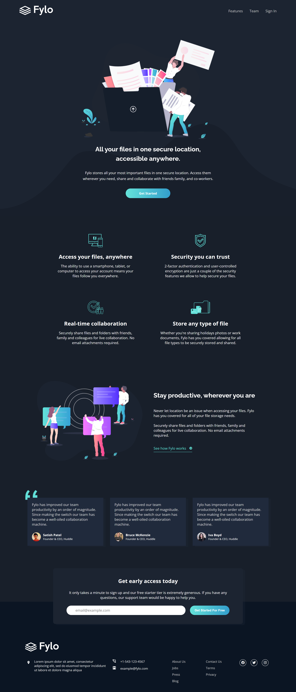
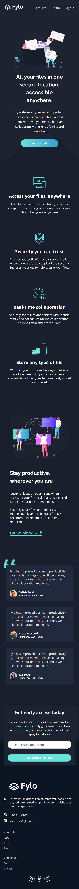

# Frontend Mentor - Fylo dark theme landing page solution

This is my solution to the [Fylo dark theme landing page challenge on Frontend Mentor](https://www.frontendmentor.io/challenges/fylo-dark-theme-landing-page-5ca5f2d21e82137ec91a50fd). Frontend Mentor challenges help you improve your coding skills by building realistic projects.

**NOTE: I did not have access to the Figma sketch file, so the design is far from being pixel perfect.**

## Table of contents

- [Overview](#overview)
  - [Screenshots](#screenshots)
- [My process](#my-process)
  - [Links](#links)
  - [Built with](#built-with)
- [Author](#author)

## Overview

### Screenshots

**Screenshot Desktop**

**Screenshot Mobile**

## My process

### Links

- Live Site URL: [Solution Hosted using GitHub Pages](https://marvin-figueroa.github.io/fylo-dark-theme-landing-page/)

### Built with

- Semantic HTML
- CSS Flexbox
- CSS Grid
- Media Queries
- Desktop-First approach
- Basic DOM Manipulation
- Basic Event Handling

## Author

- Frontend Mentor - [@Marvin-Figueroa](https://www.frontendmentor.io/profile/Marvin-Figueroa)
